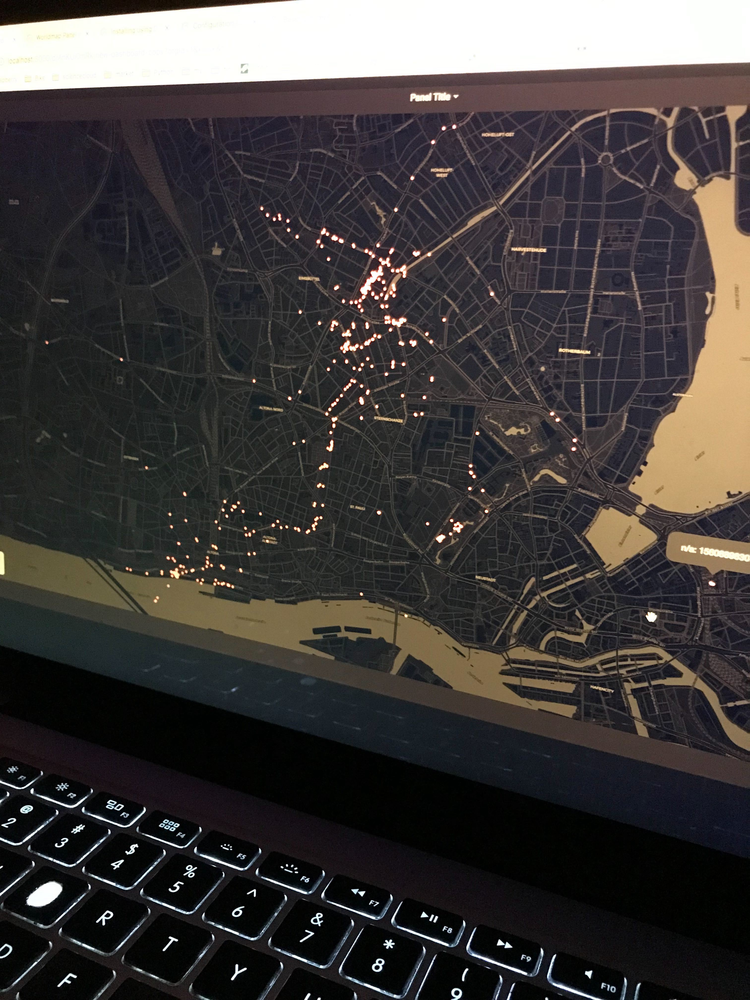
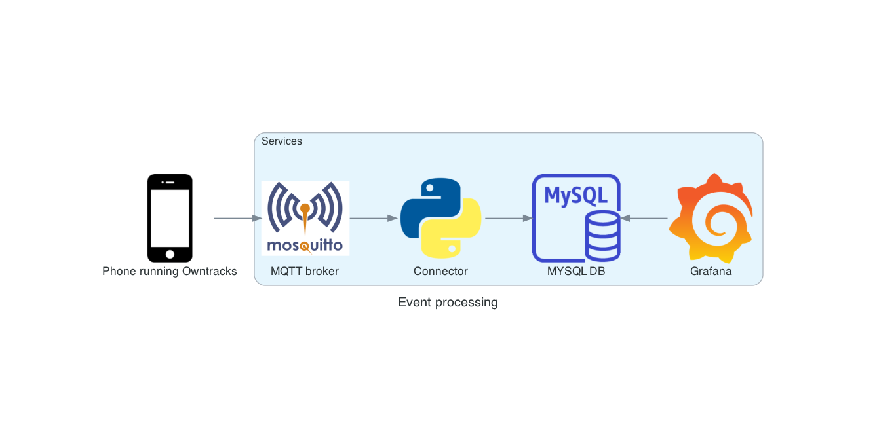

# Realtime Geographic Logger

Log the geographic position of your(self) mobile phone in real-time for visualization and analytics purposes.

# Requirements

- [Owntracks](https://owntracks.org/) is an app for iOS that regularly sends geographic coordinates as events to an 
  MQTT broker.

- The broker container needs to be accessed from the phone's internet connection. My solution is to run it on a
  Rasberry Pi 3 and use a free dynamic-dns service for domain resolution and traffic redirection.

- You need to have the `Docker` stack installed in order to spin up different containers with `docker-compose`. In a 
  Raspberry Pi 3, I used [this](https://dev.to/elalemanyo/how-to-install-docker-and-docker-compose-on-raspberry-pi-1mo) 
  page.  

# How to run ?

MQTT broker, mysql db and the connector can be spun off as services with `docker-compose`.

`docker-compose run` should spin of 3 different containers. To test it locally, enter the IP address of your host to 
Owntrack. Each time you trigger a new message from Owntracks, you should be able to see corresponding information on 
the logs of the 3 containers.

